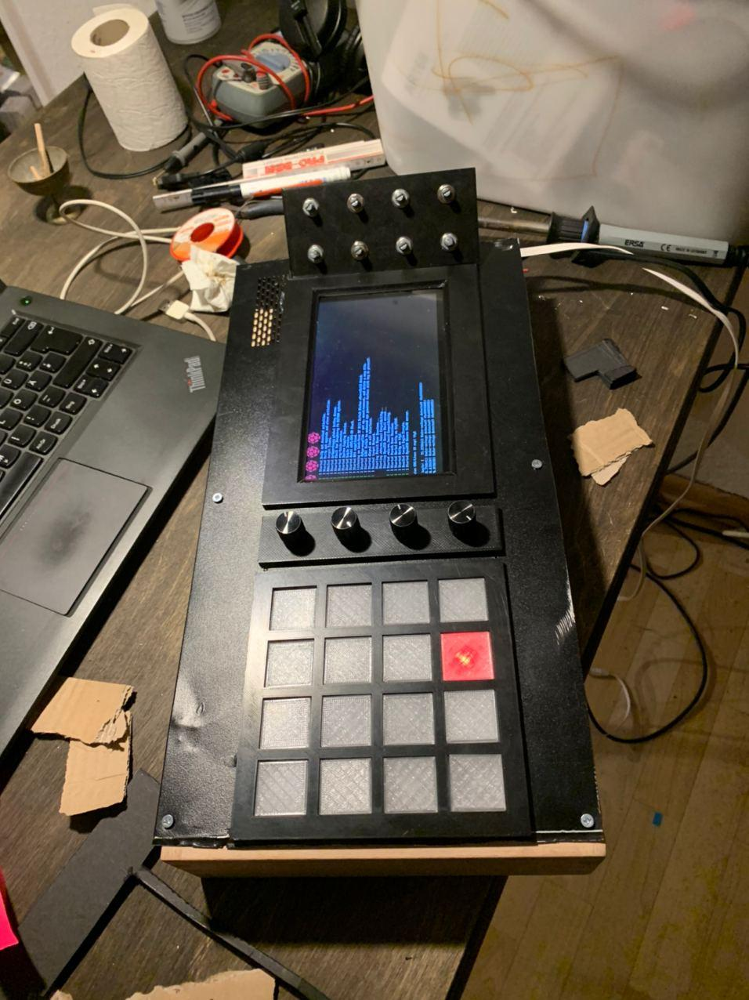

## 2.1 Produktbeschreibung

Der 3D-Audio-Controller-Stack ist das weltweit erste DJ-Mischpult mit mehr Kanal Tonausgabe und intuitiven Bedingung, zur Interaktiven und automatisieren Bewegung von Schallquellen.

1. Mixer Controller
2. Motion Controller
3. Kleiner Audioserver
4. Großer Audioserver

### Festival, Club Konzerte
- Controller-Stack
    - ersetzt klassischen DJ-Mixer
- Großer Audioserver
    - Unser Audio Server ersetzt Klassische DSP
    - Kann als zentraler Rekorder für Rohdaten der Veranstaltung genutzt werden. Inklusive Metadaten.
    - Kann mehrere Controller-Stack's gleichzeitig verwalten
    - Hohe order Ambisonic möglich

### Studio
- Controller-Stack
    - kann als DAW Controller genutzt werden
- Kleiner Server (Option)
    - Rekordding
    - DAW
- Großer Server (Option)
    - Rekordding
    - DAW

### Zuhause
- Controller-Stack
- Kleiner Server
- Beschallungsbandel mit KirschAudio oder Hifi im Hinterhof

---
# #Alt

Beschallung im 21. Jahrhundert sollte mehr sein als Stereo. Da Musik vorwiegend in Stereo produziert wird, ist das Ziel unseres Produkts eine möglichst einfach verständliche Möglichkeit zu bieten, diese in einer Mehr-Lautsprecher-Anordnung live zu bewegen. Durch diese Möglichkeit wird das ein-dimensionale Klangbild Stereo (links/rechts) um eine zweite Dimension (vorne/hinten) bereichert. Für die spätere Entwicklung ist auch die dritte Dimension (oben/unten) geplant. Das Verfahren zur Verräumlichung, welches wir zurzeit einsetzen heißt, Ambisonic. Es ist kein großes Problem unser Produkt auf weitere System wie Wellenfeldsynthese oder Vbap aus zuweilen. Das Problem bisher besteht in der Komplexität der Thematik, der Kompatibilität zu den Veranstaltungs- und Präsentationsumgebungen und der aufwendigen Konfiguration in der Musikproduktion. Diese Probleme werden folgendermaßen gelöst:

- Die Komplexität wird durch unsere Software auf einem Server (entweder im DJ-Mixer-Controller (standalone) oder extern (more Power) vor dem Nutzer verborgen und durch das selbsterklärende Interface trivialisiert. Gestützt wird das Produkt durch eine detaillierte Dokumentation im Github Repository.

- Die Kompatibilität wird durch die Möglichkeit der Modus-Umschaltung am Motion-Controller gewährleistet. Damit kann jeder der 4 Kanäle zu Mono, Stereo oder Ambisonic konfiguriert werden.

- Die aufwendige Anpassung der Musikproduktionsumgebung entfällt ebenfalls, da unser System in der Lage ist nach Stereo zu konvertieren. Es gibt eine physikalische Einschränkung für 3D Audiosysteme, der maximale Durchmesser der Lautsprecherinstallation beträgt ca. 19 Meter. Es besteht die Möglichkeit den Kreis in eine Richtung mit Stereo zu erweitern, um große Veranstaltungsszenarien abzudecken. Direkte Konkurrenten gibt es nicht, nur indirekte, das sind Mixer Hersteller und Software-Plug-ins für DAW’s. Keines der Plug-ins löst die Problematik der einfachen Bedienung der Audiobewegung. Es gibt keine Mixer, die auf die speziellen Bedürfnisse von 3D-Audio ausgelegt sind.

---

