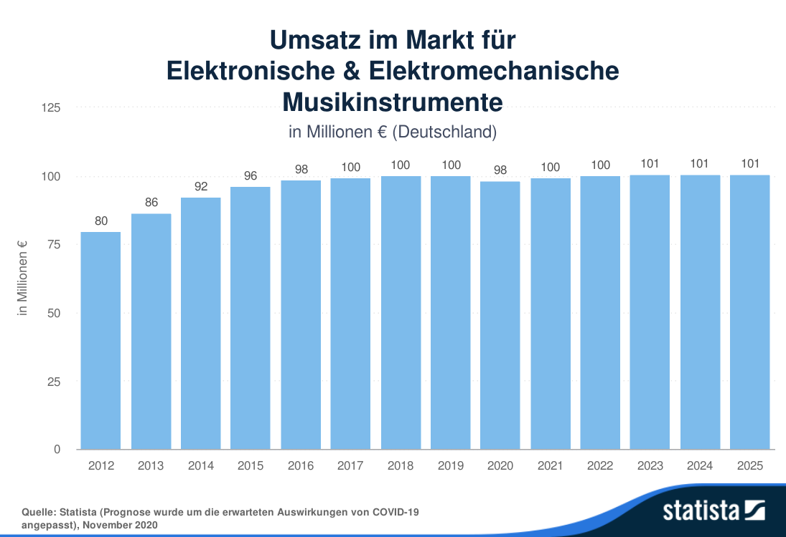
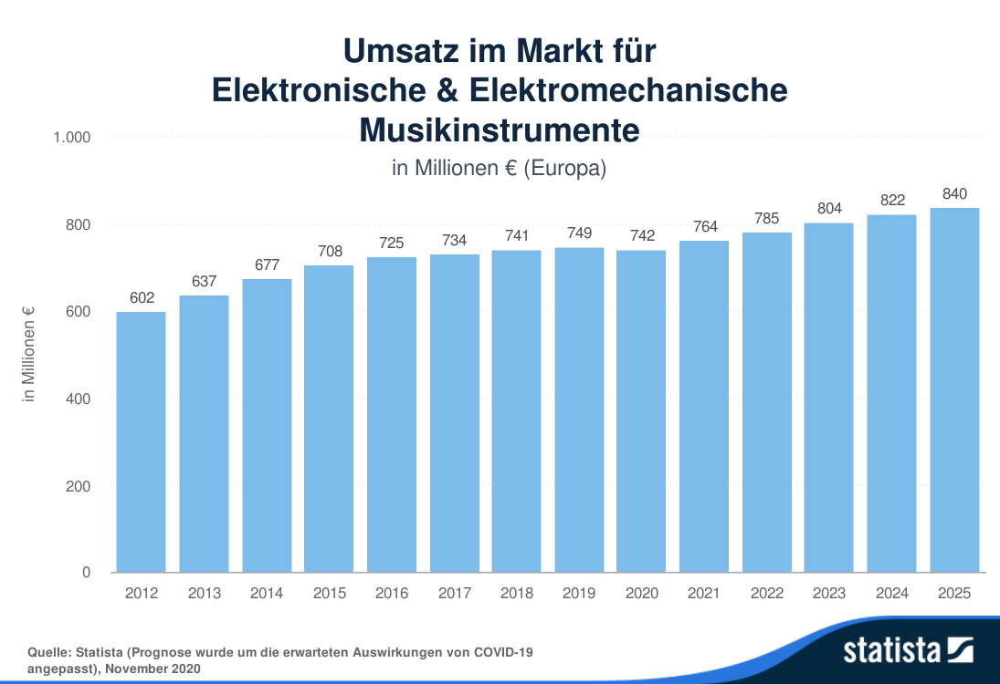
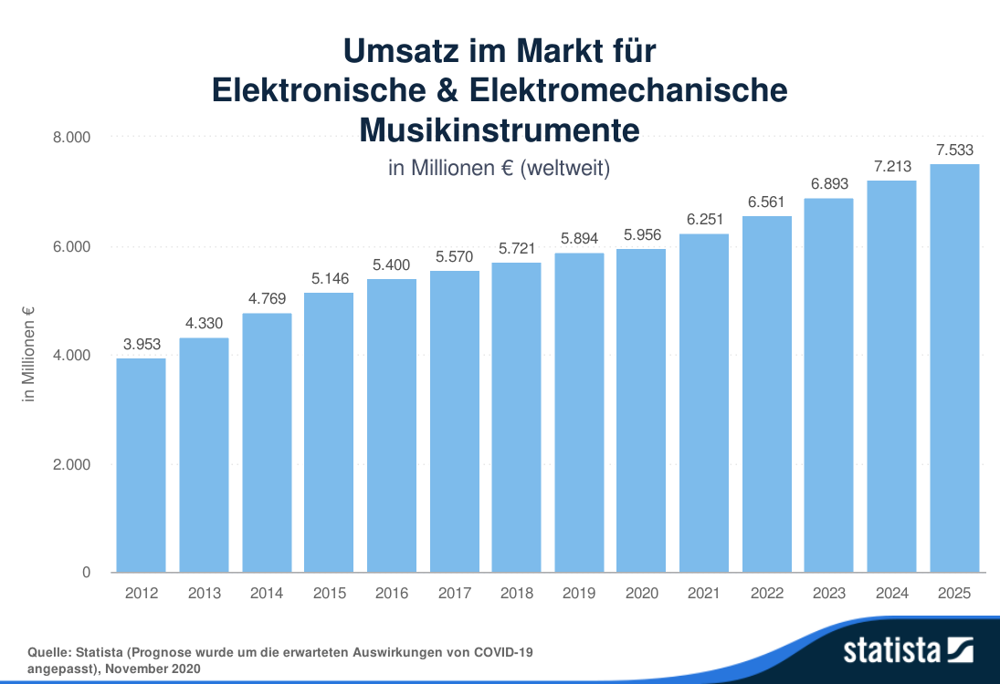

## 4.3. Marktpotential

Marktpotenzial ist nicht exakt bekannt da es keine Vergleichsprodukte gibt. Es ist aber zu beobachten, dass immer mehr 3D Audio Anwendungen in die Konsumelektronik Einzug halten, zum Beispiel die neuen Kopfhörer von Apple. Unsere Bewertung des Potenzials leitet sich aus Gesprächen mit Künstler, Kunden und Interessenten ab.

### Marktprognose für elektronische Musikinstrument

### 1 Jahr

- Erweiterung des Bekanntheitsgrades durch Versendung von Exempels + Showcases.
- 24 geplante Exempels
- Userfeedback
- Testberichte
- Aufbau und Maintating der AAA Community

### 2 Jahr

- Produkt Optimierung auf Grund von User- und Community- Feedbacks
  Baugruppen Design
- Entwicklung QA verfahren
- Kosten Optimierung
- Marketing
- Referenzen schaffen
- Community stärkenProdukt Optimierung auf Grund von User- und Community- Feedbacks
  Baugruppen Design
  Entwicklung QA verfahren
  Kosten Optimierung

#### ab 3 Quartal

Beginn erster Serien Produktion
 Vertriebsstruktur aufbauen
Community stärken
Kontaktaufnahme zu 1000 Potenzellen Kunden, wir gehen davon aus das 1/3 Interesse hat und von den 20 % je eins kaufen. 
Marketing
Referenzen schaffen

#### ab 3 Quartal

- Beginn erster Serien Produktion
- Vertriebsstruktur aufbauen
- Kontaktaufnahme zu 1000 Potenzellen Kunden, wir gehen davon aus das 1/3 Interesse hat und von den 20 % je eins kaufen.
