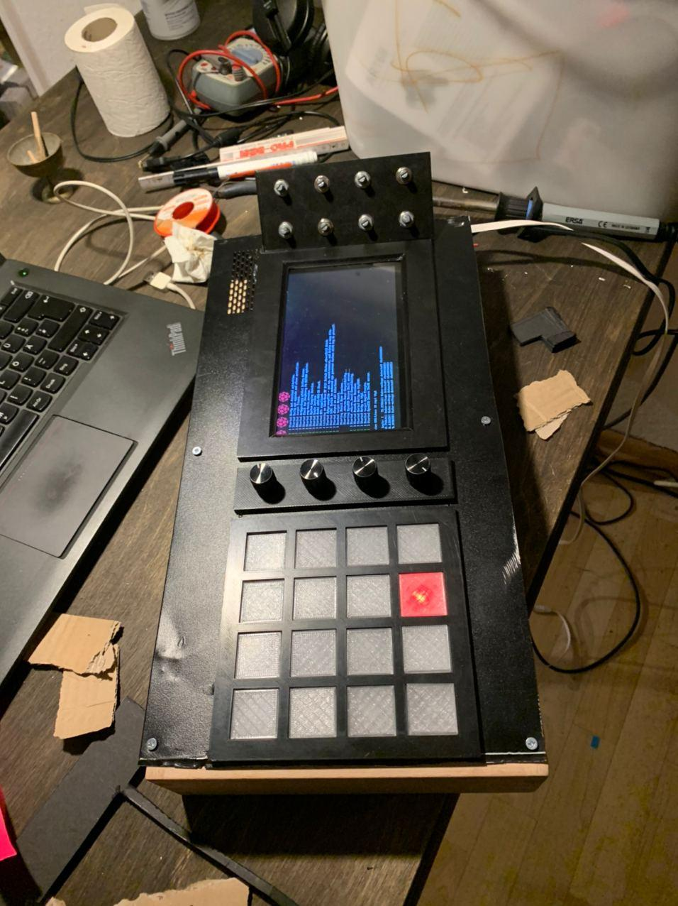
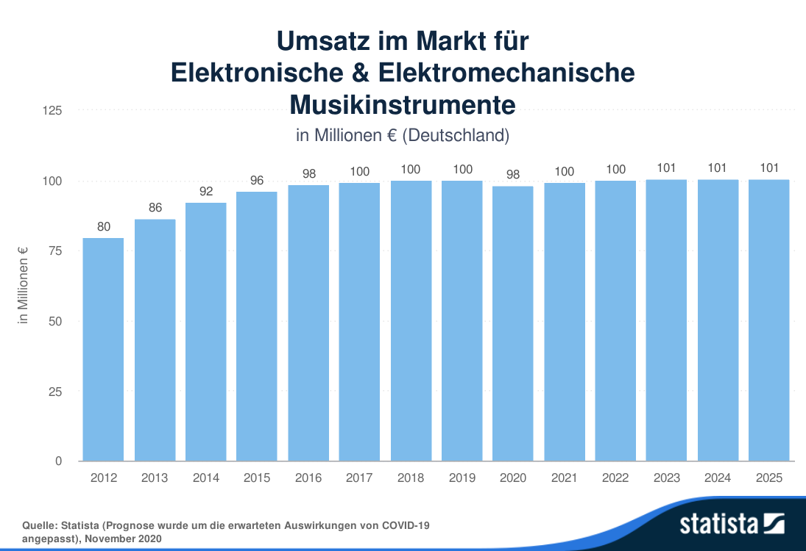
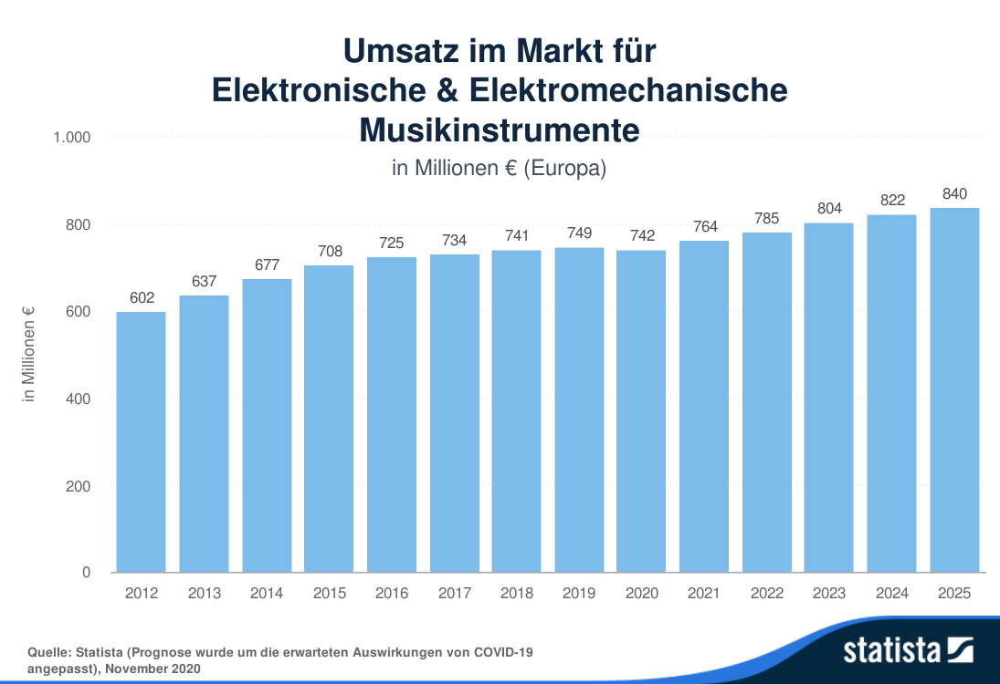

# Businessplan AAA

[[Toc]]

## Zusammenfassung

## Produkt

### Produktbeschreibung

- [ ] Produkt beschreibung alter text muss Uberarbeitet werden

<alt>
Beschallung im 21. Jahrhundert sollte mehr sein als Stereo. Da Musik vorwiegend in Stereo produziert wird, ist das Ziel unseres Produkts eine möglichst einfach verständliche Möglichkeit zu bieten, diese in einer Mehr-Lautsprecher-Anordnung live zu bewegen. Durch diese Möglichkeit wird das ein-dimensionale Klangbild Stereo (links/rechts) um eine zweite Dimension (vorne/hinten) bereichert. Für die spätere Entwicklung ist auch die dritte Dimension (oben/unten) geplant. Das Verfahren zur Verräumlichung, welches wir zurzeit einsetzen heißt, Ambisonic. Es ist kein großes Problem unser Produkt auf weitere System wie Wellenfeldsynthese oder Vbap aus zuweilen. Das Problem bisher besteht in der Komplexität der Thematik, der Kompatibilität zu den Veranstaltungs- und Präsentationsumgebungen und der aufwendigen Konfiguration in der Musikproduktion. Diese Probleme werden folgendermaßen gelöst:

- Die Komplexität wird durch unsere Software auf einem Server (entweder im DJ-Mixer-Controller (standalone) oder extern (more Power) vor dem Nutzer verborgen und durch das selbsterklärende Interface trivialisiert. Gestützt wird das Produkt durch eine detaillierte Dokumentation im Github Repository.

- Die Kompatibilität wird durch die Möglichkeit der Modus-Umschaltung am Motion-Controller gewährleistet. Damit kann jeder der 4 Kanäle zu Mono, Stereo oder Ambisonic konfiguriert werden.

- Die aufwendige Anpassung der Musikproduktionsumgebung entfällt ebenfalls, da unser System in der Lage ist nach Stereo zu konvertieren. Es gibt eine physikalische Einschränkung für 3D Audiosysteme, der maximale Durchmesser der Lautsprecherinstallation beträgt ca. 19 Meter. Es besteht die Möglichkeit den Kreis in eine Richtung mit Stereo zu erweitern, um große Veranstaltungsszenarien abzudecken. Direkte Konkurrenten gibt es nicht, nur indirekte, das sind Mixer Hersteller und Software-Plug-ins für DAW’s. Keines der Plug-ins löst die Problematik der einfachen Bedienung der Audiobewegung. Es gibt keine Mixer, die auf die speziellen Bedürfnisse von 3D-Audio ausgelegt sind.

<alt/>

Der 3D-Audio-Controller-Stack ist das weltweit erste DJ-Mischpult mit mehr Kanal Tonausgabe und intuitiven Bedingung, zur Interaktiven und automatisieren Bewegung von Schallquellen.

1. Mixer Controller
2. Motion Controller
3. Kleiner Audioserver
4. Großer Audioserver

#### Festival, Club Konzerte

- Controller-Stack
  - ersetzt klassischen DJ-Mixer
- Großer Audioserver
  - Unser Audio Server ersetzt Klassische DSP
  - Kann als zentraler Rekorder für Rohdaten der Veranstaltung genutzt werden. Inklusive Metadaten.
  - Kann mehrere Controller-Stack's gleichzeitig verwalten
  - Hohe order Ambisonic möglich

#### Studio

- Controller-Stack
  - kann als DAW Controller genutzt werden
- Kleiner Server (Option)
  - Rekordding
  - DAW
- Großer Server (Option)
  - Rekordding
  - DAW

#### Zuhause

- Controller-Stack
- Kleiner Server
- Beschallungsbandel mit KirschAudio oder Hifi im Hinterhof

### Technische_Merkmale_und_Daten

#### Controller-Sack

- OSC I/O
- PoE

##### Mixer-Controller

- Maße H85mm B320mm L370mm

##### Motion-Controller

- Maße H85mm B260 L400mm

#### Kleiner Audio Server

- 5.1 Audio out
- 4CH Stereo in
- Arch Linux
- 19" Rack 1HE
- Midas Preamps
- Server Software
- Plug-and-play Auslieferung
- DAW

#### Großer Audioserver

- I/O- Dante, Madie, AES 50
- Arch Linux
- 19" Rack 2-3HE
- DAW
- Beratung (Option)
- Installation (Option)
- Anpassung (Option)

### Konkurrenzprodukte

#### Direckte Konkurenten

Es gibt keine Direckte Konkurenz

#### Indireckte Konkurenten

- Allen and Head

  - Xone 92 1300EUR
  - Xone 96 2000EUR

- Peeonier

  - DJ900 2200EUR

- DigiCon
- Lisa
- Sagetracker Senheisaer
- DAW Controller

### Stärken und Schwächen

#### Stärken

- OpenSorce
- OpenhardWare
- Flexibel
- Modular
- Verfaren kompatibel zu bestehenden und kuenftigen standars
- Erweiterbar
- Langlebigkeik
- Reperierbar

#### Schwächen

- mit kleinem Server nur 4 X Stereo in
- Max 18m Kreisdurchmesser

### Zielgruppen

- [ ] Zielgrupper ueberarbeiten

<alt>
Die primär Zielgruppe sind Musiker, Produzenten, Musikclubbetreiber, Kulturstätten und Technikverleiher. Die Preisgestaltung orientiert sich an dem aktuellen (quasi-) Industriestandard Allen & Heath Xone 92 oder Pioneer DJM 900 (~ € 2000,-) Es gebiet noch eine Sekunde Zielgruppe, die Augmented- und Virtual-Reality Anwendungen umfasst.
<alt/>

### Kundennutzen

- Einfache und Intuitive interaktion mit 3D Sound
- Erfahrung und Erschaffung neuer Klanerfahrung
- AAA Community
- Open Sorce
- Aktive mit Gestaltung des Produktes
- Freikonigurierbar
- Soveranitat von Properiterer Software

#### Erleinstellungmerkmale

- Einfache und Intuitive interaktion mit 3D Sound
- Ueberfuehrung Mono/Stereo zu 3DAudio
- Abwerskompatiebel zu bestehende Audiosystemen
- AAA Community

### Herstellung / Produktion

#### Intern

- Endmontage
- QA
- Konfiguration
- Montage

#### Green Wasching

- Co2 Bilanz von Produktion erstellen
- Dafür Moor renaturiesirung

### Entwicklungsstand

Derzeit arbeiten wir am Bau einer Prototypenreihe. Diese dient einerseits zur technischen Weiterentwicklung, andererseits als Präsentationsobjekt für spätere Kunden. Durch das haptische „Erleben“ kann der Kunde den besonderen, für ihn wichtigen Nutzen erfahren. Gegenwärtig wird die Planung und Finanzierung der Prototypen detailliert.

Durch Eigenmittel und gute Konditionen für Materialeinkauf wird der Teil der Prototypen finanziert. Mehrere potentieller Zulieferer haben bereits ihr Interesse bekundet und für die ersten Kleinserien Sonderkonditionen zugesagt.

#### Haben:

- Protoyp Moc
- Protoyp Kleiner Server
- Protoyp Grosser Server
- Alle Komponenten Komonizieren mit einander

Zurzeit liegt unser Enwiklungsfokus auf der Ausarbeitung Usability der GUI des Motion Controllers.

_Produktwerbung_ bedeutet zurzeit hauptsächlich die Kontaktaufnahme zu Schlüsselkunden in den Marktsegmenten Messen und Ausstellungen. Diesen zeigen wir die Einsatzmöglichkeiten und Vorteile des showcase und informieren sie über den Entwicklungsstand. Diese Kontakte ermöglichen dem Planungsteam eine kundenorientierte Entwicklungsstrategie.

- [ ] Das hier miuss verschoben werden

### Weitere Entwicklungsschitte

#### in Milestones

- [ ] Milestones Pflegen

- Entwicklungs-Milestone Prototype (Alpha Release)
  - GUIv0.02 in QT6
  - MotionLooper v0.01
  - Hausing ueberarbeiten Mixer/Contolller
- Entwicklungs-Milestone Design Freeze (Minimum viable produt(MVP))
  - PCB Mic v.0.03
  - PCB Moc v.0.03
  - PCB Butten Matrix v.0.02
  - Doku
  - Webseite mit shop v0.02
- Milestone Beta-Release

#### 1 Jahr

- Erweiterung des Bekanntheitsgrades durch Versendung von Exempels + Showcases.
- 24 geplante Exempels
- Userfeedback
- Testberichte
- Aufbau und Maintating der AAA Community

#### 2 Jahr

- Produkt Optimierung auf Grund von User- und Community- Feedbacks
- Baugruppen Design
- Entwicklung QA verfahren
- Kosten Optimierung
- Marketing
- Referenzen schaffen
- Community stärkenProdukt Optimierung auf Grund von User- und Community- Feedbacks
- Baugruppen Design
- Entwicklung QA verfahren
- Kosten Optimierung

##### ab 3 Quartal

- Beginn erster Serien Produktion
- Vertriebsstruktur aufbauen
- Community stärken
- Kontaktaufnahme zu 1000 Potenzellen Kunden, wir gehen davon aus das 1/3 Interesse hat und von den 20 % je eins kaufen.
- Marketing
- Referenzen schaffen

---

## Gründerteam

#### Jendrik Bradaczek

- gb. 1984

##### Ausbildung:

- 2003 Abitur
- 2010 - 2014 Ausbaubildung zum Fotograf
- seit 2018 Studium Interface Design

##### Berufserfahrung:

- SFX-Technicker
- System- , Netzwerk-Administrator
- Freiberuflicher Fotograf
- Mitbegründer von Kallias (Musiklabel)

#### Raphael Eisman

- gb. 1983

##### Ausbildung:

- Mediengestalter Bild und Tone

##### Berufserfahrung:

- IT-Systemadministration, ISB
- Hifi im Hinterhof (Planung- Beratung, Verkauf)
- FOH-Technik, Veranstaltungstechnik

---

#### Kompetenzen

- Fünf Jahre Erfahrung mit 3D Audio
  - Ideenentwicklung
  - Projektplanung
  - Konzeptumsetzung
  - Kunden und Künstler Kommunikation
  - Beschallungskonzepte
  - Userfeedback
  - Netzwerken

#### Kompetenzluecken

- Kaufmännisch
- Elektrotechnik
- Juristisch

#### Supporter und Partner

- SweedAudio
- RWTH Aachen
- TU-Berlin
- GörnerSchweizer
- LiCHTPiRATEN
- Acid Paulie
- Sasha (Wie war noch sein Künstlername)
- Max (Wie war noch sein Künstlername)
- Frieder Weiss
- BIRDMILK COLLECTIVE

#### Referencen

- Gardelegen
- Garbicz 2018
- Chaos Communication Congress 35C3
- Garbicz 2019
- Diverse Studio-Sessions @ Holzmark

---

## Marktanalyse

### Gesamtmarkt

### Marktsegmentierung

### Marktpotential

Marktpotenzial ist nicht exakt bekannt da es keine Vergleichsprodukte gibt. Es ist aber zu beobachten, dass immer mehr 3D Audio Anwendungen in die Konsumelektronik Einzug halten, zum Beispiel die neuen Kopfhörer von Apple. Unsere Bewertung des Potenzials leitet sich aus Gesprächen mit Künstler, Kunden und Interessenten ab.

#### Marktprognose für elektronische Musikinstrument

### Wettbewerber

---

## Marketing

### Produktpolitik

### Preispolitik

### Kommunikationspolitik

### Vertriebspolitik

---

## Unternehmen und Organisation

### Firmenphilosophie

### Rechtsform, Geschäftsführung, Eigentum

### Organisation

### Personal

### Kosten

### Risikomanagement

---

## Finanzplanung

### Rentabilitätsvorschau

### Kapitalbedarf und Finanzierungsplanung

---
